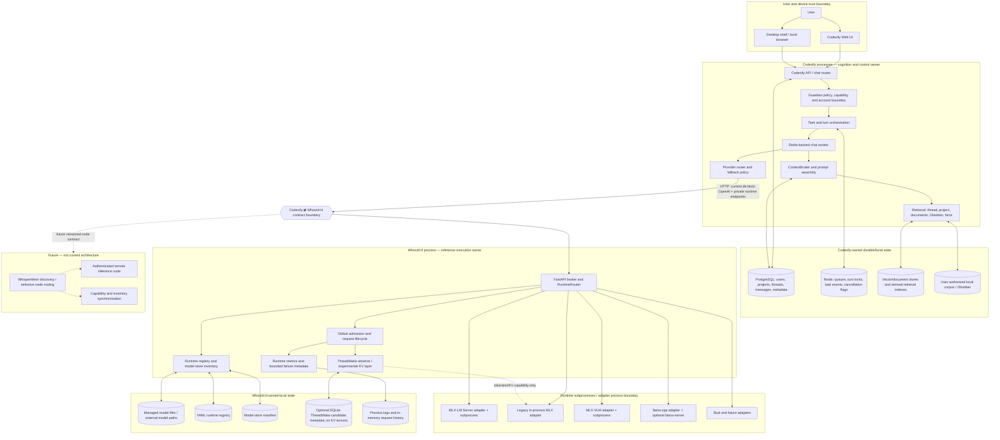

# Codexify ⇄ Whoosh’d Architecture Review

**Review date:** 2026-07-18

**Review type:** Principal-architect current-state assessment and technical consultation

**Codexify evidence baseline:** `main` at `db6b946577cf34f7ec2691093d44eba2098b3d05`

**Whoosh’d evidence baseline:** `main` at `b60b03504da59a62a5378d9ae637586a3c7aadeb`
**Mutation posture:** Review-only. No product source, configuration, canonical documentation, runtime, or git state was changed; this report is the only new artifact. The pre-existing untracked Whoosh’d `dump.rdb` was left untouched.

## Review verdict

The intended separation is technically sound and is already visible in the implementation: Codexify owns the user, identity, policy, context, task, and durable-conversation planes; Whoosh’d owns the model-execution plane. They communicate over HTTP and do not import one another. That is the strongest architectural fact in the system.

The combined product is not yet coherent as a supported system because that boundary is governed by several overlapping, unversioned, and partly contradictory contracts. The highest-risk consequences are concrete:

1. Codexify can silently ignore a Whoosh’d mid-stream error and persist the partial text as a completed assistant response.
2. Whoosh’d creates cancellation IDs that Codexify cannot discover through the normal chat contract, so cancellation is not end-to-end.
3. Whoosh’d model advertisement can include artifacts that are merely compatible on disk, not runnable by a configured adapter.
4. ThreadWake’s current safe value is observe-mode analysis. Its documentation simultaneously claims metadata-only operation and functioning ephemeral/session KV reuse; the live path lacks the scope identity and backend fidelity required to enable reuse safely.
5. Current Codexify `main` has configuration, documentation, and test expectations for the Whoosh’d path that disagree with one another, including a supposedly local single-node profile hard-coded to a remote `100.127.148.28` endpoint.
6. Operational privacy is not yet compliant with the stated non-negotiable: Codexify contains active logging paths for generated text, graph candidates containing generated text, and raw API keys.

The governing decision for the next stage should be:

> Adopt one versioned Local Inference Provider Contract v1, with executable conformance fixtures in both repositories, and do not add scheduler, persistence, or network features until one ordinary Codexify turn passes that contract from prompt assembly through durable reload and failure recovery.

This is not a rewrite recommendation. It is a canon-and-invariants recommendation.

---

## Evidence method and classification

Implementation wins over documentation. A current test proves only the seam it exercises; a mocked test is not live runtime proof. A validation report is treated as historical machine-specific evidence unless reproduced on this baseline.

| Classification | Meaning in this report |
|---|---|
| **Implemented and validated** | Present in current code and supported by focused automated or live evidence appropriate to the claim |
| **Implemented but insufficiently validated** | Present, but evidence does not cover the target runtime, failure mode, or end-to-end path |
| **Partially implemented** | Material behavior exists, but the required lifecycle or cross-boundary behavior is incomplete |
| **Interface present but behavior incomplete** | Endpoint, type, or UI/control surface exists but cannot yet deliver the implied contract |
| **Specification only** | Described in docs, ADRs, plans, or fixtures without a live implementation |
| **Historical or superseded** | Once-relevant evidence or design that is no longer current truth |
| **Contradicted by another source** | Current sources make incompatible claims and cannot both be canonical |
| **Missing** | Required behavior has no implementation evidence |
| **Unknown because evidence is unavailable** | Could not be established on this machine or baseline |

### Validation performed during this review

| Evidence | Result | Interpretation |
|---|---:|---|
| Whoosh’d targeted contract suite: admission, queue, routing, runtime guards, vision, registry, ThreadWake HTTP/scope/metadata | **313 passed** | Strong automated evidence for those isolated seams |
| Whoosh’d broad suite excluding two Metal-import collection failures | **2,060 passed; 41 failed** | 33 failures were caused by MLX importing without an available Metal device; 8 were time-dependent ThreadWake snapshot fixtures that had expired by the review date. Broad suite is not green on the review environment. |
| Codexify focused sidecar, ThreadWake segment, inventory route, runtime truth, and context delivery suite | **Passed** | Mocked/component evidence for those seams |
| Larger Codexify Whoosh’d-focused selection | **28 failed** | Current tests, supported-profile endpoint, model aliases, smoke Compose, and provider-resolution assumptions have drifted apart. This is repository evidence, not merely an environment failure. |
| Live `127.0.0.1:8000` Whoosh’d and `127.0.0.1:8888` Codexify probes | **Unavailable** | Both services were offline. No current live end-to-end claim is made. |

Historical validation packets show real MLX, llama.cpp, VLM, overload, and experimental ThreadWake smoke runs on earlier baselines. They are valuable evidence of feasibility, not confirmation of current combined behavior.

---

# 1. Executive diagnosis

## What Codexify is today

Codexify is a local-first application and cognition control plane implemented primarily as a web UI, API, Redis-backed task system, durable chat/project store, Guardian policy/capability layer, context construction service, retrieval system, persona/system-profile prompt layer, and multi-provider router.

Its ordinary chat completion is not a direct UI-to-model call. The API validates account/thread scope, derives thread and project settings, assembles retrieval directives, acquires a per-thread turn lock, and enqueues a `ChatCompletionTask`. A worker reconstructs scoped context, selects a provider/model, streams progress, optionally executes a bounded tool turn, persists the assistant message, and emits completion metadata. That is materially more than a chat UI.

Status: **Implemented but insufficiently validated as a complete supported loop.** The major pieces exist, but current `main` does not have a green, current, live Codexify⇄Whoosh’d proof on the reviewed configuration.

## What Whoosh’d is today

Whoosh’d is a local inference broker and small runtime control plane. It presents OpenAI-compatible chat and model discovery plus Whoosh’d-specific health, readiness, lifecycle, request tracking, cancellation, admission, registry, and ThreadWake observability endpoints. It routes aliases to MLX-LM Server, legacy in-process MLX, MLX-VLM, llama.cpp, external routes, or a deterministic stub.

Status: **Implemented and validated at the broker/component level; implemented but insufficiently validated for the current Codexify deployment.** It is independently usable and its core HTTP seams have extensive tests. Resource telemetry and several advanced execution claims remain simulated, experimental, or machine-specific.

## What ThreadWake is today

ThreadWake is an opt-in prompt-prefix analysis and experimental exact-prefix KV-reuse framework inside Whoosh’d. Its reliable current product value is metadata-only observation: segment hashes, candidate scoring, estimated reusable tokens, backend capability reporting, and bounded analysis surfaces.

ThreadWake is not memory, identity, retrieval, or cognition. The current production-safe claim is **observe mode only**. Ephemeral/session code exists, but safe useful reuse is not established on the live Codexify path.

Status: **Observe mode implemented and validated; KV reuse interface present but behavior incomplete; durable KV snapshots specification/research only and explicitly deferred.**

## What the system was trying to become

The consistent original thesis was a sovereign local intelligence stack in which:

- a user-facing cognition system owns identity, memory, context, projects, tasks, and authority;
- a replaceable local runtime broker makes heterogeneous models operable and observable;
- repeated long prompts can eventually be accelerated without converting runtime cache state into identity or human memory;
- local nodes can later be connected without moving cognition or authority into the inference plane.

That thesis remains sound. Drift occurred because multiple generations of implementation documents were retained as if they were simultaneous current truth, and because runtime experiments were added faster than the inter-repository contract was closed.

## What is structurally correct

- The repositories are independent and communicate over HTTP.
- Codexify owns identity-scoped retrieval, prompt construction, task orchestration, and durable response persistence.
- Whoosh’d owns adapter routing, model lifecycle, runtime health, admission, and inference execution.
- Liveness, readiness, model lifecycle, request lifecycle, and capacity pressure have distinct types and surfaces in Whoosh’d.
- A busy Whoosh’d returns structured `429` rather than being modeled as offline.
- ThreadWake is housed below the inference boundary and is explicitly described as not memory.
- The default Whoosh’d overload policy is reject-only; its optional queue is off.
- Real MLX, VLM, and llama.cpp adapter lanes exist without requiring Codexify imports.

## What prevents the system from feeling whole

The system lacks one end-to-end invariant chain. Codexify can construct an excellent context, but the runtime handshake does not prove that the chosen advertised alias is runnable, ready, capacity-available, cancellable, and speaking the same stream/error version. Whoosh’d can execute a request, but Codexify does not retain a runtime request identity or distinguish every terminal stream state. Documentation and tests then describe different defaults, making operator success depend on local knowledge.

The result is a system with many legitimate components but no single authoritative answer to: “Can this exact Codexify turn execute on this exact Whoosh’d model now, and what happens at every failure point?”

---

# 2. Current-state system map



## Ownership and trust-boundary reading

| Plane | Source of truth | Control owner | Process owner | Trust boundary |
|---|---|---|---|---|
| User/account/project/thread | Codexify database | Guardian/Codexify | Codexify | User/account boundary |
| Persona/system prompt | Codexify configuration and prompt builder | Codexify | Codexify | Must never grant authority |
| Durable messages and memory | Codexify stores | Codexify | Codexify | Account/project/thread scopes |
| Retrieval/context | Codexify ContextBroker and indexes | Codexify | Codexify | Corpus authorization boundary |
| Provider choice/fallback | Codexify provider policy | Codexify | Codexify worker | Egress/provider boundary |
| Model-to-runtime resolution | Whoosh’d runtime registry/router | Whoosh’d | Whoosh’d | Runtime process boundary |
| Admission and execution | Whoosh’d runtime state/adapters | Whoosh’d | Whoosh’d and child runtimes | Resource/capacity boundary |
| Model files | Whoosh’d model store or explicitly configured external paths | Whoosh’d operator | Whoosh’d/runtime OS user | Filesystem boundary |
| ThreadWake KV/cache | Whoosh’d process memory | Whoosh’d, with opaque scope supplied by Codexify | Whoosh’d | Must not cross scope or process identity |
| Distributed nodes | **No current source of truth** | Future | Future | Network and node-identity boundary |

The map intentionally does not place user IDs, personas, memory, or retrieval inside Whoosh’d.

---

# 3. Responsibility and sovereignty audit

| Responsibility | Present owner | Correct owner | Duplication / missing contract | Prescribed correction |
|---|---|---|---|---|
| Identity | Codexify account/session and Guardian layers | Codexify | Whoosh’d accepts an OpenAI-style `user` field but has no identity role; ThreadWake docs refer to user scope | Remove semantic identity from Whoosh’d contract. Use only an opaque, non-reversible cache-scope token when required. |
| Personas | Codexify system-profile/persona prompt assembly | Codexify | ThreadWake segment vocabulary names persona layers, but Whoosh’d should see segments only | Keep persona as prompt metadata/content segmentation. State explicitly that it grants no permissions, state ownership, or actor identity. |
| Permissions | Guardian capability and account-scope code | Codexify | No Whoosh’d auth/policy boundary beyond network reachability | Keep user permissions in Codexify. Add node/transport authentication only for non-loopback Whoosh’d modes. |
| Durable memory | Codexify DB, message history, personal facts, retrieval stores | Codexify | ThreadWake “session” terminology can be misread as durable conversation memory | Rename/document ThreadWake session mode as `process_continuation` if retained. Never expose it as memory. |
| Retrieval | ContextBroker and Codexify retrieval lanes | Codexify | None at the Whoosh’d boundary | Preserve. Whoosh’d receives the final prompt, not retrieval authority or corpus access. |
| Prompt construction | Codexify completion service and ContextBroker | Codexify | Whoosh’d applies runtime chat templates, which is correct, but extra request fields are forwarded without strict negotiation | Define prompt/message schema and separate app-level segments from backend sampling fields. Whoosh’d owns tokenizer/template rendering, not semantic context assembly. |
| Thread/project scope | Codexify DB and task context | Codexify | ThreadWake wants thread/project/user scope, but Codexify does not transmit scope IDs and Whoosh’d request types do not declare them | Send a single opaque cache-scope token only when ThreadWake is enabled. Do not send raw identity or project ownership semantics. |
| Provider routing | Codexify selects local vs cloud and fallback | Codexify | Provider pinning is derived from any resolved provider, suppressing fallback in cases that appear implicit | Make `provider_pinned` mean explicit user/policy pin only. Add tests for 429, 503, transport failure, and local-only no-cloud behavior. |
| Model-aware runtime routing | Whoosh’d RuntimeRouter | Whoosh’d | Static YAML, adapter inventory, external routes, and model-store advertisement can disagree | Make one resolved model descriptor the routing authority and derive all inventories from it. |
| Queueing | Codexify Redis task queue; optional Whoosh’d FIFO | Codexify for work; Whoosh’d only for bounded runtime admission buffering | Two queues can create hidden double waiting | Keep Whoosh’d queue off by default. Enable only with measured ordinary-load 429 evidence and expose wait time distinctly. |
| Retries | Codexify provider orchestration | Codexify | No explicit 429 backoff contract; generic endpoint probing can reinterpret failures | Codify retryability per error. Retry only before first output, with bounded jitter/backoff and no silent cloud fallback. |
| Provider fallback | Codexify worker | Codexify | Current pin/source semantics and generic endpoint fallback obscure intent | Separate endpoint compatibility probing from provider fallback. Preserve local-only policy as a hard constraint. |
| Model lifecycle | Whoosh’d adapters/runtime | Whoosh’d | Broker-global lifecycle and per-runtime lifecycle can diverge | Make readiness model-specific and return a resolved descriptor for the requested alias. |
| Model storage | Whoosh’d managed store or explicit external routes | Whoosh’d | Two registries are called “one truth” but are independently authoritative | Use model-store record as artifact truth and a derived runtime binding as execution truth; YAML becomes declarative override/import, not a parallel catalog. |
| Caching | ThreadWake for inference KV; Codexify for retrieval/application caches | Split by layer | ThreadWake scope binding is incomplete; SQLite name suggests persistence beyond metadata | Keep cache types explicitly named. KV never leaves Whoosh’d; retrieval/result caches never move into Whoosh’d. |
| Telemetry | Both, per owned layer | Split and correlated | Request IDs do not cross the boundary; Codexify has content/secret logging violations | Introduce correlation IDs and a content-free schema. Remove raw-output, graph-candidate-content, and API-key logs immediately. |
| Authentication | Codexify authenticates users; Whoosh’d currently unauthenticated | Codexify for users; Whoosh’d for node/transport | Codexify sends a bearer value that Whoosh’d does not enforce | Loopback may remain OS-trust only. Sidecar/LAN/remote modes need explicit node credentials and bind rules. |
| Process launch/shutdown | Codexify sidecar manager and Whoosh’d CLI/runtime subprocess managers | Codexify owns the sidecar child; Whoosh’d owns its runtime children | Codexify tracks PID/session only in memory; helper script binds `0.0.0.0`; CLI and sidecar are separate ownership systems | Use a launch nonce and exact child handle; default to loopback; never kill a listener not carrying the launch identity. |
| Cancellation | Codexify task flag and Whoosh’d internal token | Split: Codexify requests; Whoosh’d executes | No shared request ID; stream disconnect is the only practical propagation | Echo a client request ID, expose a Whoosh’d execution ID before streaming, and map task cancellation to the runtime endpoint. |
| Distributed synchronization | Quarantined/speculative Codexify federation; absent in Whoosh’d | Future Codexify/node protocol | No coherent node identity, contract version, or state ownership | Do not build yet. Later synchronize capabilities/inventory only; never synchronize Codexify memory through Whoosh’d. |

## Sovereignty risks

### Inference infrastructure drifting into cognition

- ThreadWake segment names include persona, project, tool, and thread concepts. This is acceptable only as opaque cache segmentation. It becomes a cognition leak if Whoosh’d decides which context belongs in the prompt, infers identity, or owns durable scope.
- The OpenAI `user` field is described as an end-user identifier. In the intended architecture Whoosh’d does not need it for abuse monitoring in localhost mode. Retaining raw identity would create metadata and authority leakage.
- “Session mode” implies a conversation concept even though its valid role is process-local prefix continuation.

### Codexify depending on undocumented Whoosh’d behavior

- Codexify decides OpenAI versus Ollama behavior partly from URL shape and compatibility fallbacks, not a negotiated capability.
- It assumes any 2xx SSE that ends is successful; it does not require `[DONE]` or reject an `error` data frame.
- It consumes `/v1/models` as catalog evidence even though Whoosh’d may include compatible-but-not-runnable model-store entries.
- Managed sidecar detection reads the first non-stub runtime rather than negotiating the requested model’s readiness.
- Codexify’s bearer key, model aliases, ThreadWake fields, and retry behavior are not part of a versioned shared schema.

---

# 4. Canonical contract review

## Current contract audit

| Behavior | Current reality | Evidence class | Required correction |
|---|---|---|---|
| Model discovery | `/v1/models` and `/api/tags`; Codexify merges live inventory with configured/profile fallbacks | **Partially implemented** | Treat live Whoosh’d inventory as authoritative. A degraded fallback must be visually and machine-readably distinct from executable inventory. |
| Aliases vs raw paths | YAML aliases route correctly; legacy/env adapters and external paths can surface repository IDs or paths | **Partially implemented** | Public IDs must be stable aliases. Paths remain private descriptor fields and never become the client contract. |
| Liveness | `/health` always returns process-level 200 with high-level runtime fields | **Implemented and validated** | Keep liveness content-free and independent of readiness/capacity. |
| Readiness | `/ready` checks broker lifecycle or any non-stub ready adapter, not readiness of the requested alias | **Partially implemented** | Add model-specific readiness or include executable model states in discovery. Generic readiness must not authorize every advertised model. |
| Warmup | Broker endpoint warms all registered adapters | **Implemented but insufficiently validated** | Support `POST /v1/runtime/models/{alias}/warmup`; do not wake every lane by default. |
| Degraded states | Typed broker/runtime states exist | **Implemented and validated at component level** | Normalize reason codes across global, per-runtime, per-model, and sidecar surfaces. |
| Overload/429 | Structured body and distinct admission counters; no `Retry-After` header | **Implemented and validated** | Add reason enum, `retry_after_ms`, and `Retry-After`. Codexify must keep provider online and show busy. |
| Retry/backoff | Documented as expected; Codexify does not implement an explicit Whoosh’d 429 policy in the stream path | **Specification only / missing** | Bounded pre-first-token retry with jitter. Never retry unchanged structural 400s or after partial output. |
| SSE streaming | Standard chunks and `[DONE]` on success | **Implemented and validated** | Make terminal semantics contractual, including request IDs and error frames. |
| Mid-stream failure | Whoosh’d emits `data: {"error":...}` and closes without `[DONE]`; Codexify ignores the error object and generator completion looks successful | **Contradicted / unsafe** | Define one terminal error event. Codexify must fail the task, mark partial text noncanonical, and never persist it as completed. |
| Cancellation | Whoosh’d internal endpoint works for a Whoosh’d-generated ID; Codexify only has its task ID/Redis flag | **Interface present but behavior incomplete** | Accept/echo client request ID and return execution ID before body bytes. Wire Codexify cancel to Whoosh’d. |
| Vision | OpenAI content parts, MLX-VLM adapter, route capability rejection, and Codexify vision selection exist | **Implemented but insufficiently validated on current baseline** | Put modality/capability in the model descriptor and add current live image-turn proof. Remove stale docs claiming vision is absent. |
| ThreadWake metadata | Codexify sends message-level segment metadata and mode/scope; Whoosh’d accepts extra fields and observes them | **Partially implemented** | Declare the schema. Add opaque scope token, schema version, content-hash algorithm, and response metrics contract. |
| Thread/project/user propagation | Codexify sends no IDs; Whoosh’d scope extraction looks for undeclared fields | **Missing** | Do not send raw IDs. Send a per-install HMAC/opaque scope token with declared scope class. |
| Sidecar process ownership | Codexify tracks child PID plus Whoosh’d session ID in memory and refuses to stop mismatches | **Implemented but insufficiently validated** | Add launch nonce/ownership token, persisted only for the process lifetime, and test PID reuse/restart/unknown listener. |
| Unknown-process detection | Existing reachable process is treated external; helper launcher only checks `/health` | **Partially implemented** | Verify server identity/version/capability before accepting it as Whoosh’d. Never bind managed mode to an arbitrary healthy service. |
| Version negotiation | FastAPI/package version exists but package reports `0.1.0rc1` while `pyproject.toml` is `0.1.0rc3`; no protocol version | **Missing and contradicted** | Separate `protocol_version` from build version and derive build version from one source. |
| Capability negotiation | Inferred from endpoints and model metadata | **Missing** | Add a single well-known capabilities document with feature levels, not booleans alone. |
| Authentication | Codexify sends bearer `local`; Whoosh’d does not enforce it | **Interface illusion** | Contractually declare `auth_mode=none_loopback` or enforce a per-launch capability secret. |

## Minimal Local Inference Provider Contract v1

The stable contract should remain small. OpenAI compatibility stays the data plane; one Whoosh’d discovery document defines operational semantics.

### 1. Discovery and negotiation

`GET /.well-known/whooshd`

```json
{
  "protocol": "whooshd-local-inference",
  "protocol_version": "1.0",
  "server_version": "0.1.0rc3+<commit>",
  "session_id": "process-random-id",
  "auth_mode": "none_loopback",
  "features": {
    "streaming": "v1",
    "midstream_error": "sse-error-v1",
    "cancellation": "request-id-v1",
    "vision": "openai-content-parts-v1",
    "threadwake": "observe-v1"
  },
  "limits": {
    "max_active_requests": 2,
    "max_messages": 256,
    "max_prompt_chars": 1000000,
    "max_output_tokens": 32768
  }
}
```

Unsupported and experimental are explicit states, not absent keys. Codexify rejects an incompatible major protocol version and disables optional features with unknown levels.

### 2. Model discovery

Keep `GET /v1/models`, but require a descriptor under `metadata.whooshd`:

```json
{
  "id": "llama-3.2-3b-mlx",
  "metadata": {
    "whooshd": {
      "runtime": "mlx_lm_server",
      "modalities": ["text"],
      "capabilities": ["chat", "streaming"],
      "artifact_state": "compatible",
      "execution_state": "ready",
      "runnable": true,
      "loaded": true,
      "context_window": 131072
    }
  }
}
```

Codexify may select only `runnable=true`. `execution_state` may be `cold`, `warming`, `ready`, `busy`, `degraded`, or `failed`; `offline` is reserved for the runtime lane, not capacity pressure. A compatible artifact that lacks a bound runtime must not appear as a runnable OpenAI model.

### 3. Request identity and cancellation

- Codexify sends `X-Request-ID: <Codexify task/turn UUID>`.
- Whoosh’d validates it, stores it as the external correlation ID, and returns it unchanged.
- Whoosh’d returns `X-Whooshd-Request-ID` on both JSON and streaming responses before content begins.
- `POST /runtime/requests/{whooshd_id}/cancel` is idempotent. Repeated cancellation returns the terminal state, not an opaque 409.
- Whoosh’d retains bounded terminal request records and evicts them by count/age.

### 4. Error and retry contract

```json
{
  "error": {
    "code": "RUNNER_OVERLOADED",
    "reason": "active_limit",
    "message": "Runtime is busy.",
    "retryable": true,
    "retry_after_ms": 250,
    "request_id": "..."
  }
}
```

Rules:

- `429 active_limit|queue_full`: alive and busy; retryable as stated.
- `503 warming|temporarily_degraded`: alive but not ready; retry only after discovery/readiness.
- `400 capability_mismatch|context_overflow|invalid_request`: not retryable unchanged.
- `404 model_unknown`: refresh inventory once; do not probe unrelated endpoint dialects.
- `5xx`: failed execution; never automatically retry after any output byte unless idempotent replay is explicitly proven.

### 5. Streaming contract

- Success ends with a normal finish chunk and exactly one `[DONE]`.
- Failure before the first chunk is a normal non-2xx JSON error.
- Failure after the first chunk emits one `event: error` / `data: <error-v1>` terminal frame and closes without `[DONE]`.
- Missing `[DONE]` without a terminal error is `STREAM_TRUNCATED`.
- Codexify may display partial text transiently, but must not persist it as an assistant message with completed status.

### 6. ThreadWake contract

```json
{
  "threadwake": {
    "schema_version": 1,
    "mode": "observe",
    "scope_class": "thread",
    "scope_token": "opaque-install-bound-HMAC",
    "segments": []
  }
}
```

No raw user, project, or thread ID crosses the boundary. Whoosh’d must treat the token as an equality boundary only. It cannot infer identity or authorize access with it.

### 7. Sidecar ownership

- Codexify launches Whoosh’d with a random launch nonce in a protected environment variable or inherited descriptor, never a command-line secret.
- Discovery returns a proof derived from that nonce only to the local caller.
- Codexify stops only the exact `Popen` child whose PID, session ID, and launch proof all match.
- A healthy listener without the proof is external. It may be used only if its protocol/auth posture is accepted, and it is never killed.

---

# 5. ThreadWake reconciliation

## The three generations

| Generation | Representative claim | Actual status | Disposition |
|---|---|---|---|
| Durable SSD-backed snapshot design | Persist KV tensors, restore across restarts, tiered cache | Research/specification; metadata manifests and SQLite candidate records exist, but no production backend can serialize/restore KV safely | Archive as research. Keep deferral ADR, not roadmap promise. |
| RAM-only exact-prefix reuse | Ephemeral and session modes reuse or extend KV in process | Framework and experimental MLX adapter exist; useful safe hit path is not established | Retain as experimental code only after contract defects are fixed. Remove “full KV reuse” from current overview. |
| Observe/metadata system | Hash/segment/score/report; no output change, no KV materialization | Current safe, tested product behavior | Make this canonical for the next release. |

## What exists now

- Prompt graph compilation, segment hashing, policy evaluation, token estimates, cache-key construction, in-memory index, candidate scoring, replay analysis, health metrics, flush endpoint, and optional SQLite candidate/manifest metadata.
- Codexify message-level `threadwake_segments` emission when a Whoosh’d-specific flag is enabled.
- A tokenizer adapter for legacy in-process MLX behind a flag.
- An MLX prompt-cache adapter behind `WHOOSHD_THREADWAKE_MLX_KV_EXPERIMENTAL`.
- Ephemeral/session orchestration and fake/test backend lifecycle harnesses.
- No production durable KV tensor persistence or restore.

Classification: observe path **implemented and validated**; experimental reuse **interface present but behavior incomplete**; snapshot materialization **specification/test harness only**.

## Backend reality

| Backend | Prompt segmentation/estimates | Real tokenizer access | KV ownership | Safe reuse today | Reason |
|---|---:|---:|---:|---:|---|
| Stub/fake | Yes | Synthetic | Fake test handle | Test only | Proves orchestration, not inference fidelity |
| Legacy in-process MLX | Yes | Possible behind flag | Experimental prompt-cache object | **No production claim** | Backend is registered as `mlx` while live route passes `mlx_lm`; cloning is unimplemented; concurrency/fidelity unproven |
| MLX-LM Server | Yes | Opaque to broker | Server-owned | No | Whoosh’d cannot obtain or resume exact server KV |
| MLX-VLM | Yes | Opaque/unsupported for this path | Runtime-owned | No | Multimodal template/token fidelity and KV interface absent |
| llama.cpp HTTP | Yes | Opaque to broker | llama.cpp slot/server-owned | No | No versioned public slot snapshot/resume contract is integrated |

## Current correctness blockers

1. **Backend key mismatch.** `MLXInferenceAdapter.kind` is `mlx_lm`, while its tokenizer and KV adapters register under `mlx`. The FastAPI bridge passes `adapter.kind`, so the live path sees the capability as unsupported.
2. **No valid scope binding.** Whoosh’d extracts `thread_id`, `user_id`, and `project_id` attributes that the chat request does not declare and Codexify does not send. A scope named `thread` therefore lacks a thread boundary.
3. **Clone is unimplemented.** The MLX hit path calls `clone_kv`; the adapter always raises and falls back.
4. **Miss overhead is real.** Experimental misses can prefill a cache, then the normal adapter performs full generation. Until measured, this can be slower than doing nothing.
5. **Streaming bypasses reuse.** The current bridge applies only to non-streaming requests, while ordinary Codexify interaction is streaming.
6. **Segment fidelity is coarse.** Codexify emits message-role segments, not stable layers for Guardian policy, persona body, tool manifest, project context, and history with independently proven invalidation.
7. **Capability gates disagree.** One config helper says MLX KV reuse is hard-disabled while another experimental environment gate can report experimental capability.

The July 1 live smoke proves that two real MLX requests completed, entries were created, and health surfaces did not leak content. It explicitly did not prove performance or clone behavior. It should be relabeled “experimental observation/prefill creation smoke,” not evidence that reusable KV hits accelerate inference.

## Claims to retire

- “Ephemeral mode provides full KV reuse” as a current fact.
- “Session mode resumes monotonic conversations” as a current supported fact.
- “Every lookup validates thread/user/project scope” until an opaque scope token is required and tested.
- Any description of SQLite metadata as a durable KV snapshot.
- Any claim that stable prefixes improve latency without a paired baseline on the same model/hardware/request.
- “The worst case is a cache miss.” Experimental misses can add duplicate prefill work, memory pressure, and invalidation risk.

## Next two releases

### Release N: ThreadWake Observe v1

- Support only `off` and `observe` through the Codexify contract.
- Version the segment schema and opaque scope token.
- Record actual prompt-token counts only when backend tokenizer fidelity is proven; label estimates otherwise.
- Measure eligibility rate, repeated exact prefixes, estimated reusable tokens, analysis overhead, and model/runtime identity.
- Disable experimental ephemeral/session modes from supported configs and UI.

### Release N+1: One-backend experimental proof

Only if Release N data shows repeated stable prefixes large enough to matter:

- choose one backend with owned tokenizer, template, KV object, cancellation, and concurrency semantics;
- fix backend identity and exact scope binding;
- prove byte/token/template equality between cached and uncached prompts;
- implement safe ownership or cloning without shared mutable KV state;
- benchmark streaming and non-streaming TTFT against observe-off baselines;
- keep the feature experimental and per-process.

## Durable snapshots decision

**Remain deferred through both releases.** Revisit only when all four conditions hold:

1. a backend exposes a stable, documented save/restore API;
2. restoration is output-equivalent across supported versions and quantizations;
3. measured disk restore is faster than prefill on target workloads;
4. encryption, revocation, deletion, and metadata-linkability have a defensible local privacy model.

## Metrics that justify keeping ThreadWake

ThreadWake earns continued investment only if a representative 30-day observe sample shows:

- at least 20% of ordinary interactive requests have an exact stable prefix of at least 1,024 backend tokens repeated within the process lifetime;
- projected reusable prefill tokens exceed ThreadWake analysis overhead by at least 10×;
- the experimental backend later reduces median TTFT by at least 20% and p95 TTFT by at least 10% on eligible requests;
- output equivalence and invalidation tests are 100% across edits, model/template/tokenizer changes, cancellation, and concurrent requests;
- cache-related fallback/error rate is below 0.1%;
- no cross-scope hit and no raw-content/identity telemetry occurs.

If these gates are not met, retain the learning in the report and remove the runtime path. A compelling name is not a maintenance justification.

---

# 6. Runtime and scheduling review

## Terms that must not be conflated

| Term | Meaning in this system | Current reality |
|---|---|---|
| API concurrency | Requests accepted by the HTTP service at the same time | Bounded globally in Whoosh’d; also bounded by runtime adapters |
| Simultaneous active inference | Model executions consuming compute together | Adapter-dependent; not equivalent to accepted requests |
| Backend batching | One backend operation combining multiple requests | Experimental and disabled; not needed for the ordinary interactive loop |
| Multi-model routing | Selecting among model/runtime pairs | Implemented through the runtime registry, but residency and capacity truth are incomplete |
| Distributed execution | Selecting a different machine or trust domain | Future only; it must not be inferred from multi-runtime support |

## Current-state assessment

- Codexify already has a durable task queue, worker lifecycle, per-turn Redis lock, cancellation flag, and provider fallback logic. This is the correct place for user-visible priorities, retry budgets, and background-versus-interactive policy.
- Whoosh’d has global reject-before-execution admission control, optional FIFO queueing, adapter-local semaphores, lifecycle counters, and cancellation objects. The queue is off by default. This is structurally sound for a local inference appliance.
- MLX server, MLX-VLM, and llama.cpp adapters have their own concurrency limits. The legacy in-process MLX path lacks an equivalent inference semaphore and should default to one active inference until measured safe.
- The reported memory totals/usage in runtime state are placeholders, not host measurements. They cannot support capacity policy, model admission, or operational claims.
- The cache-aware scheduler exists as code but is not the active policy. Enabling it now would add policy before the system has trustworthy cache hits or workload evidence.
- Optional batching is not production-safe. Its error path can turn a failed batch member into a successful HTTP assistant payload containing an error string. It should remain disabled until failure semantics are corrected.

Classification: admission control **implemented and validated**; per-runtime limits **implemented but inconsistently enforced**; internal queue **implemented and validated but intentionally disabled**; cache-aware scheduling **partially implemented**; batching **experimental and unsafe to advertise**; capacity/thermal policy **interface present but behavior incomplete**.

## Queue decision

Do **not** enable an internal Whoosh’d queue for the ordinary Codexify path yet. Codexify already queues work. A second hidden FIFO increases latency, makes cancellation ambiguous, and turns capacity pressure into invisible waiting. Keep Whoosh’d reject-only by default and return an explicit, machine-readable `busy` response before the first token.

Enable a bounded internal queue only if measurements show all of the following:

1. direct non-Codexify clients are common;
2. short capacity bursts cause material 429 rates;
3. a queue reduces failed user interactions without unacceptable p95 latency;
4. queued cancellation and deadlines are proven;
5. the response exposes admission wait separately from execution time.

## Smallest useful scheduler evolution

1. Add an inference semaphore of one to the in-process MLX adapter.
2. Return `Retry-After`, `error.code=busy`, retryability, model alias, and request ID on pre-stream overload.
3. Let Codexify retry a busy, unpinned request at most twice with bounded exponential backoff and jitter, within a visible task deadline. A pinned provider may retry the same provider; fallback requires explicit policy.
4. Show “provider busy” separately from “offline” and “failed.” Never mark the provider unhealthy because admission is full.
5. Propagate cancellation to the Whoosh’d request ID and prove resource release.
6. Replace placeholder memory data with best-effort unified-memory pressure and process RSS; label unavailable fields as unavailable.
7. Calibrate each supported model/runtime pair with conservative defaults: maximum active inference, context ceiling, warm footprint, cold-load time, and known modality.

Do not add priority classes until the measured mix contains competing interactive and background work. When it does, Codexify should own priority and deadline; Whoosh’d should accept a small execution class such as `interactive` or `background` only as a capacity hint, never as identity or authority.

## Resource and fairness findings

| Concern | Diagnosis | Prescription |
|---|---|---|
| Starvation | Optional Whoosh FIFO has no class fairness; cache scheduler could favor repeated prefixes | Keep queue off; if later enabled, use bounded aging and deadlines |
| Interactive vs background | Codexify has the semantic knowledge; Whoosh’d does not | Prioritize in Codexify; pass only execution-class hints |
| Context length | Declared model metadata is not sufficient proof of allocatable memory at that length | Enforce calibrated context ceilings and return `context_too_large` before load |
| Unified memory | Current values are stubs | Measure pressure where possible; otherwise use conservative residency rules |
| Multi-model residency | Routing exists, residency policy does not | Start with one warm heavyweight model; evict explicitly and report lifecycle |
| Batching | Disabled experiment with unsafe member-error semantics | Keep off for latency-sensitive local use; repair and benchmark before reconsidering |
| Thermal pressure | Not observed | Add best-effort host pressure/thermal state as operational data, not a promise |
| Cancellation | Whoosh’d has request cancellation; Codexify cannot address the request | Contractually expose request ID and cancellation outcome |

---

# 7. Model lifecycle and registry review

## Required state machine

| State | Precise meaning | Current enforcement | Classification |
|---|---|---|---|
| Candidate | A discovered path or artifact not yet trusted | Model-store discovery/import supports this idea | Implemented but terminology is inconsistent |
| Registered | Durable manifest record with stable internal identity | Durable model store implements registration | Implemented and validated |
| Compatible | Static and/or live checks say a named runtime can load it | Compatibility checks exist but do not prove execution for every runtime | Partially implemented |
| Advertisable | Safe to return to a client as a selectable alias | `/v1/models` merges configured models with compatible store records | **Contradicted**: compatibility can be advertised without an executable registry binding |
| Runnable | RuntimeRouter has an enabled adapter binding and validated model reference | Enforced for execution, but not consistently for discovery | Implemented and validated at request time |
| Warm | Runtime/model is resident and initial load has completed | Runtime lifecycle and warmup endpoints approximate this | Implemented but insufficiently validated across adapters |
| Ready | Runnable, within current capacity, and able to accept a request now | Global readiness is exposed, but model-specific readiness/capacity is not authoritative | Interface present but behavior incomplete |

The critical invariant is:

`advertisable => runnable binding exists`

That invariant does not hold today. The durable model store and authoritative runtime YAML are useful separate concepts, but their merged discovery surface falsely implies a single lifecycle. Codexify should never have to infer whether a model returned by `/v1/models` can actually execute.

## Registry and alias findings

- Stable aliases are the correct public surface. Raw paths are deployment-local implementation details and must not cross the Codexify boundary.
- The runtime registry correctly resolves enabled model aliases to adapter configurations and guards unsupported backends. This is a strong foundation.
- Managed model storage, external references, and runtime configuration are three distinct ownership modes. They are not yet presented as one coherent onboarding workflow.
- Capability claims such as vision and context size are mostly metadata. They need static validation plus a small runtime conformance check before they become advertised capabilities.
- Modality detection from filenames/config is useful as a candidate hint, not execution proof.
- Failed loads need a bounded failure record and a transition out of warm/ready without deleting the registered model.
- Configuration has drifted across aliases and base URLs. Codexify’s selected profile, documentation, smoke compose file, and tests currently name different network addresses and model aliases.

## Prescribed user journey: “I have a model” to safe Codexify use

1. **Discover or import.** Create a candidate record. Copy into managed storage or retain an explicit external reference; never silently move external files.
2. **Inspect.** Record format, size, hashes where practical, probable architecture, quantization, modality, and required adapter. Treat these as observations.
3. **Static compatibility.** Match the artifact to an installed adapter and host requirements. Failure remains visible and recoverable.
4. **Bind an alias.** Create a stable, path-free model alias in the authoritative runtime registry. Reject alias collisions.
5. **Dry load and conformance.** Load under a deadline; perform a minimal content-free health generation; verify streaming shape, cancellation, and claimed modality.
6. **Calibrate.** Record cold-load time, warm footprint, conservative context ceiling, and default concurrency for this host/runtime/model tuple.
7. **Advertise.** Return the alias only after the runnable binding passes. Expose `warm` and `ready` as volatile state, not registry facts.
8. **Select in Codexify.** Codexify stores the stable alias plus required capabilities. It never stores a Whoosh’d filesystem path.
9. **Recover explicitly.** On load failure, report `registered=true`, `runnable=false`, failure code, and the last bounded failure event. Do not silently route a different model under the same alias.

An external-path model should remain an advanced mode: path access is process-local, brittle across sidecar/network modes, and unsuitable for a portable HTTP contract.

---

# 8. Observability and failure semantics

## Minimum content-free observability plane

| Signal | Whoosh’d owns | Codexify owns | Correlation |
|---|---|---|---|
| Request identity | Provider request ID, process/session ID, runtime alias, model alias | Task ID, turn ID, provider-attempt number | `trace_id` plus both request IDs |
| Latency | Admission wait, load/warmup, TTFT, total, prefill/decode when real | Queue wait, context-build time, provider attempts, persistence time, user-visible total | Same trace ID |
| Load | Active, optional waiting, rejects by reason, runtime semaphore occupancy | Queued/running tasks, worker saturation | Time-window correlation |
| Lifecycle | Adapter start/stop/load/unload/warm/fail, cancellation requested/completed | Task queued/started/retried/cancelled/persisted/failed | Attempt span |
| ThreadWake | Mode, eligibility, estimated/actual prefix tokens, hit/miss reason, reused tokens | Segment schema version and coarse segment counts | Request ID only; no scope value in metrics |
| Resource | Process RSS, unified-memory pressure if available, model residency | Worker/Redis/storage health | Host/process label |
| Failure | Bounded code, stage, retryability, adapter/model, timestamp | Task stage, selected/fallback provider, persistence outcome | Trace/request IDs |

No prompt, message, generated text, embedding input, persona/identity value, raw user/project/thread ID, file name, raw path, tool arguments, or API secret belongs in operational logs or metric labels. Scope identifiers should be opaque, keyed hashes with short retention if correlation is truly needed; otherwise omit them.

## Immediate privacy violations

The repositories do not currently meet the non-negotiable telemetry rule:

- Codexify’s worker debug logging can emit the complete assistant output.
- Graph-candidate debug logging can include generated content.
- Pulse provider initialization logs can expose raw API keys.

These are release-blocking defects, not documentation issues. Remove the values, add regression tests that capture logs with sentinel prompt/output/secret strings, and rotate any secret that may have been logged in a real environment.

## Failure vocabulary

Use a shared, versioned error envelope with at least:

- `invalid_request`
- `model_unknown`
- `model_not_runnable`
- `capability_unsupported`
- `context_too_large`
- `busy`
- `deadline_exceeded`
- `cancelled`
- `runtime_start_failed`
- `runtime_failed`
- `stream_failed`
- `internal_error`

Each failure must include stage, retryability, provider request ID, and a safe human message. Pre-stream failures use HTTP status and headers. Post-stream failures use a terminal SSE error event. A stream without a valid terminal event is incomplete, even if it emitted text.

Recent failure events should be a bounded ring (for example, 100 entries or 24 hours), content-free, locally stored by default, and resettable. Metrics must distinguish offline, not ready, busy, degraded, cancelled, and failed. Current readiness/liveness separation is good; current placeholder resource values are not operational evidence.

---

# 9. Security and deployment modes

| Mode | Threat model | Bind/transport | Authentication and secrets | Process ownership | Isolation/cache/logging |
|---|---|---|---|---|---|
| Localhost single-user | Same OS user trusted; buggy local processes possible | Loopback only; HTTP acceptable | No long-lived auth required; optional ephemeral token | User or service manager; explicit status | OS-user boundary; process-local caches; content-free local logs |
| Codexify-managed sidecar | Same user, but stale/unknown process and port hijack are relevant | Loopback only | Per-launch random bearer/capability secret passed out-of-band; never browser-visible | Codexify owns launch nonce, PID, session ID, executable/config fingerprint, shutdown | Cache scoped to sidecar session; refuse control of unmatched process; content-free logs |
| Trusted LAN | Honest-but-buggy peers plus possible untrusted LAN device | Explicit non-loopback opt-in; TLS | mTLS or narrow revocable capability token; node identity allowlist | Independent Whoosh’d service; Codexify never assumes PID ownership | Per-client quotas; no identity/persona data; bounded caches; no content logs |
| Remote node | Malicious network, replay, compromised remote node, partitions | TLS with certificate verification; no plaintext fallback | Mutual node identity, scoped capabilities, rotation/revocation, replay-resistant request envelope | Remote operator owns process; Codexify owns task policy | Treat node as data recipient; explicit model/content policy; opaque scope; auditable content-free events |
| Future multi-user/team | Malicious or curious users sharing infrastructure | Authenticated encrypted transport | User/session authentication plus server-enforced capabilities | Service owner with tenant-aware operations | Per-user/tenant admission and cache isolation; deletion/audit policy; **not implemented** |

## Findings

- Localhost mode does not need enterprise identity machinery. Loopback binding and OS-user trust are a defensible default.
- The `--codexify` launcher currently binds Whoosh’d to `0.0.0.0`; that contradicts a managed local sidecar trust model and should be changed to loopback unless the user explicitly selects LAN mode.
- Codexify has a bearer-token configuration surface, but Whoosh’d does not enforce it. This is an inferred security contract and must be either implemented for managed/LAN modes or removed from claims.
- The sidecar manager’s PID/session checks are good but process-local. A launch nonce and executable/config fingerprint are needed to survive manager restarts and prevent control of an unrelated service on the same port.
- ThreadWake cache scope cannot use identity-bearing raw IDs. The contract should use a per-session opaque scope token and still enforce model/runtime/template boundaries.
- Remote nodes inherently receive prompts and outputs needed for inference. “Private” must therefore mean explicit user-selected trust and transport policy, not a blanket claim.
- Multi-user cache sharing, distributed synchronization, and team permissions are missing. They should remain out of scope until the local contract and threat model pass.

---

# 10. Product coherence

## What the combined system is—and is not

| Comparison | What that category does | What Codexify ⇄ Whoosh’d must add to be distinct |
|---|---|---|
| Chat UI pointed at Ollama | Sends messages to a local model | Durable project/thread state, governed context, provider-independent recovery, explicit failure semantics |
| OpenAI-compatible proxy | Normalizes an inference API | Model lifecycle, readiness/capacity truth, cancellation, local operational ownership |
| Local model manager | Downloads and starts models | Cognition remains above the boundary: retrieval, memory, identity, task semantics, persisted outcomes |
| RAG application | Retrieves context and generates an answer | Durable task lifecycle, permissioned context, multiple provider/runtime choices, failure recovery |
| Agent framework | Plans and invokes tools | Sovereign user/project memory and policy, with inference treated as replaceable execution |
| Inference server | Executes a model request | Codexify supplies the complete user experience and cognitive control plane; Whoosh’d supplies a dependable local inference appliance |

The finished system’s center of gravity should be **Codexify’s governed, durable local task loop**. Whoosh’d is essential infrastructure, but it should be replaceable through the contract. The value is not that two repositories exist; it is that the user’s identity, context, memory, and work remain stable while inference engines and models change.

## Smallest complete experience

A user creates or opens a local project and thread, optionally attaches a document, selects a compatible local model alias, and sends a message. Codexify authorizes and assembles scoped context, records a durable task, streams through the versioned Whoosh’d contract, distinguishes busy/offline/failure, supports cancellation, persists exactly one terminal response, and reloads the same thread after both processes restart. A persona may affect style but cannot change access. No content appears in operational telemetry.

That single experience must pass on one supported Mac/model/runtime profile before the system expands.

| Essential now | Important but deferrable | Attractive distraction | Architectural dead end |
|---|---|---|---|
| Versioned HTTP contract | Evidence-based background priority | Distributed inference marketplace | Durable ThreadWake snapshots without a stable backend API |
| One proven local model profile | Additional runtime adapters | General-purpose cache scheduler | Whoosh’d-owned memory, persona, retrieval, or task planning |
| Scoped prompt/retrieval and durable turn | Vision after text path passes | Broad OpenAI surface emulation | Raw filesystem paths as public model identity |
| Reliable SSE terminal semantics | Friendly model import UI | Multi-model simultaneous residency | Treating `200` or `/health` as readiness/completion |
| Busy/offline/failure/cancel distinction | LAN mode with explicit trust | Team/multi-user platform | Hidden double queues and unbounded retry |
| Content-free observability | One proven ThreadWake KV backend | WhisperMesh branding before protocol | Prompt-based permission enforcement |
| Restart and persistence proof | Remote node after local conformance | Autonomous persona agents | Cross-scope cache reuse |

---

# 11. Contradiction and documentation audit

## Material contradictions

| Source conflict | Evidence-backed resolution | Action |
|---|---|---|
| ThreadWake overview claims ephemeral/session reuse and scope enforcement; current README/code say observe-first and KV incomplete | Code and conservative README win | Rewrite overview; mark reuse modes experimental and unsupported |
| Persistent ThreadWake specification describes SSD-backed snapshots | No durable KV save/restore exists | Move to historical research; add a prominent non-current banner |
| Model registry document says llama execution/process lifecycle are missing | Current runtime adapter and lifecycle tests implement them | Rewrite the stale sections from current code/tests |
| `/v1/models` implies compatible store entries are usable | Execution requires RuntimeRouter binding | Split inventory from runnable model discovery or enforce the invariant |
| Codexify supported profile, integration guide, smoke compose file, and tests use different Whoosh’d addresses/aliases | No single configuration is canonical | Choose one loopback/host-gateway profile and generate all examples/tests from it |
| Codexify bearer token suggests authenticated Whoosh’d | Server does not enforce it | Implement mode-specific auth or remove the implied guarantee |
| Sidecar launcher calls managed mode but binds all interfaces | Managed local sidecar should be loopback-only | Change default binding and add an explicit LAN mode |
| Codexify stream handling treats socket close after tokens as completion; Whoosh’d can emit a terminal error without `[DONE]` | Completion contract is absent | Version SSE event types and require one terminal event |
| Whoosh’d package versions disagree (`rc1` vs `rc3`) | Build metadata must be authoritative | Generate runtime version from package metadata and test it |
| Codexify ADR index contains duplicated/misaligned numbering | ADR identity is not dependable | Renumber once, preserve redirects, and validate the index |

## Canonical document set

1. **Codexify system status:** `docs/architecture/00-current-state.md`, limited to shipped `main` evidence and explicit validation tier.
2. **Joint Local Inference Provider Contract:** one versioned schema/ADR copied or generated into both repositories, with conformance fixtures. This is the canonical integration source.
3. **Whoosh’d operator truth:** root `README.md`, focused on supported launch modes, runtimes, lifecycle, and known limits.
4. **ThreadWake truth:** `docs/threadwake/README.md`, rewritten to separate observe, experimental KV, and historical snapshot research.
5. **Model lifecycle truth:** a rewritten `docs/model-registry.md` that distinguishes inventory, runtime binding, runnable, warm, and ready.
6. **Validation index:** dated reports linked to exact commits; reports never redefine capability.

## Archive or merge

- Archive the old persistent ThreadWake specification under `docs/historical/` with a “never implemented as a production capability” banner.
- Merge competing Codexify/Whoosh’d integration guides into the joint contract plus a short operator recipe.
- Archive the stale contract review after converting unresolved findings into ADRs/issues.
- Remove duplicate architectural summaries that repeat current-state claims without commit/evidence references.
- Keep old validation reports immutable and dated; do not edit them into current specifications.

## Normalize terminology

- **live**: process responds; **ready**: service can evaluate requests; **busy**: ready but no admission capacity; **degraded**: serving with a declared impairment; **failed**: request/runtime could not complete.
- **inventory record**: discovered/registered artifact; **model alias**: stable public identifier; **runtime binding**: executable alias-to-adapter mapping; **warm**: resident; **ready model**: runnable and admissible now.
- **ThreadWake observe**: metadata/measurement only; **KV reuse**: actual backend-owned cache reuse; **snapshot**: serialized restorable KV state. Never use “cache hit” for an estimated prefix match.
- **persona**: request-scoped prompt shaping; **identity**: authenticated principal; **capability**: enforceable permission. They are not synonyms.

## Minimal ADR set

1. Responsibility boundary: Codexify cognition/control plane; Whoosh’d inference/data plane.
2. Local Inference Provider Contract v1 and compatibility policy.
3. Streaming terminal, cancellation, retry, and idempotency semantics.
4. Model inventory and runnable lifecycle state machine.
5. Deployment modes, process ownership, and authentication.
6. Content-free observability and retention.
7. ThreadWake observe-first gates and durable-snapshot deferral.
8. Remote-node prerequisites and explicit non-goals.

The single status document should have a row per capability with: classification, owner, current commit, validation tier, supported profile, known blocker, and canonical specification. No roadmap prose belongs in the “implemented” column.

---

# 12. Prescribed action plan

Effort is relative to the current codebase: **Small** is roughly days, **Medium** is roughly one to three weeks, and **Large** is multi-week cross-repository work. Estimates include tests and documentation, not just code.

## Phase 0: Canon and drift removal

| Action | Objective and architectural reason | Repository / dependencies | Deliverable and acceptance criteria | Validation / major failure modes | Effort / blocks next phase |
|---|---|---|---|---|---|
| P0.1 Contract v1 | Make independent evolution safe; remove inferred behavior | Both; no dependency | JSON/OpenAPI schemas for discovery, request, SSE, error, capabilities, cancellation, health/readiness; both repos pin `v1`; raw paths excluded | Shared conformance fixtures; negative/version tests. Risk: copying schemas that drift—generate or hash-check them | Medium / **Yes** |
| P0.2 Stream truth | Prevent partial text from becoming a successful durable answer | Both; P0.1 event vocabulary | Typed SSE events, exactly one `completed|failed|cancelled` terminal event, request ID exposed; Codexify persists success only on `completed` | Fault-injection before first token, mid-token, socket close, malformed event, cancellation. Risk: legacy fallback silently restores old behavior | Medium / **Yes** |
| P0.3 Privacy repair | Enforce the no-content/no-secret telemetry rule | Codexify first; both log tests | Remove raw output, graph content, and secret logging; safe structured logger helpers | Sentinel prompt/output/API-key capture tests and repository log-call audit. Risk: debug-only path omitted | Small / **Yes** |
| P0.4 Configuration canon | Eliminate address/alias/profile drift | Both; choose supported localhost/Compose topology | One supported model alias and base URL source generates profile, compose smoke, docs, and tests | Fresh-config static test plus live smoke when runtime available. Risk: Docker host/loopback semantics conflated | Small / **Yes** |
| P0.5 Model discovery invariant | Stop advertising non-runnable inventory | Whoosh’d, Codexify consumer; P0.1 | Separate `/inventory` from contract `/models`, or enforce runtime binding before advertisement | Test compatible-unbound model is not selectable; bound-but-cold model is advertised with `warm=false` | Medium / **Yes** |
| P0.6 ThreadWake canon | Remove false cache claims and unsupported modes | Both docs/config; no code dependency | Supported config exposes `off|observe`; overview rewritten; old SSD spec historical; backend-key/scope blockers recorded | Docs/link/config test; current capabilities never say KV reuse supported | Small / No, but required before release claims |

**Phase 0 stop condition:** no runtime expansion, queue policy, remote node, or durable cache work. Exit only when contract fixtures pass in both repositories and every supported config names the same endpoint/model alias.

## Phase 1: Core loop completion

| Action | Objective and architectural reason | Repository / dependencies | Deliverable and acceptance criteria | Validation / major failure modes | Effort / blocks next phase |
|---|---|---|---|---|---|
| P1.1 One golden local profile | Prove the ordinary sovereign loop, not a set of component claims | Both; all blocking Phase 0 work; one genuinely runnable model | Scripted user/project/thread interaction: scoped context, stream, one terminal assistant record, reload after both process restarts | Live browser/API E2E on named commit/model/host; inspect durable state. Risk: mock/stub evidence presented as live | Medium / **Yes** |
| P1.2 Busy/offline/failure policy | Make provider state legible and retries bounded | Both; P0.1/P0.2 | Codex distinguishes busy, offline, degraded, failed; max two jittered pre-token busy retries; no retry after token without idempotent resume | Inject 429, connection refusal, readiness false, midstream failure. Risk: `provider_pinned` incorrectly suppresses legitimate fallback | Medium / **Yes** |
| P1.3 End-to-end cancellation | Release compute and persist an honest terminal state | Both; exposed provider request ID | User cancel reaches Whoosh’d; adapter stops if supported; task ends cancelled; partial output policy explicit | Cancel queued, loading, prefill, decode, and after completion. Risk: backend cannot interrupt promptly | Medium / **Yes** |
| P1.4 Runnable model selection | Ensure the UI can select only an executable alias | Both; P0.5 | Codex shows capability/readiness and rejects unbound inventory; no raw paths | Contract tests plus live cold/warm selection | Small / **Yes** |
| P1.5 Persistence/idempotency proof | Prevent duplicate or lost assistant turns across worker/process failure | Codexify; P0.2 | Stable attempt/idempotency key and exactly one terminal assistant outcome per task | Kill worker before/during/after provider completion and retry. Risk: provider completed but persistence acknowledgement lost | Medium / **Yes** |

**Phase 1 stop condition:** one text model, one local machine, one user, no ThreadWake KV, no vision, no remote node. Exit only with a dated live report that separately records config, process identity, request trace, persisted record, restart/reload, and fault-injection results.

## Phase 2: Operational coherence

| Action | Objective and architectural reason | Repository / dependencies | Deliverable and acceptance criteria | Validation / major failure modes | Effort / blocks next phase |
|---|---|---|---|---|---|
| P2.1 Capability/version negotiation | Avoid client inference and silent incompatibility | Both; Contract v1 | Discovery includes contract version, server build, supported event schema, modalities, cancellation, ThreadWake modes, runtime/model readiness | Compatibility matrix for current and one older minor client. Risk: version string without behavioral fixture | Medium / **Yes** |
| P2.2 Managed sidecar ownership | Make local lifecycle safe and restartable | Both; canonical local profile | Loopback bind, launch nonce, ephemeral token, PID/session/executable/config fingerprint, unknown-process refusal, clean shutdown | Port hijack, stale PID, manager restart, wrong executable, orphan process tests | Medium / **Yes** |
| P2.3 Content-free observability | Operate and diagnose without leaking cognition | Both; request/trace IDs | Metrics/event surfaces from section 8; bounded failures; unavailable resource fields are explicit | Sentinel leak tests, cardinality tests, request trace walk. Risk: IDs or paths become content proxies | Medium / No |
| P2.4 Lifecycle/resource truth | Make readiness and capacity decisions defensible | Whoosh’d; calibrated model | Model-specific load/warm/ready/busy state; real or unavailable memory pressure; in-process semaphore | Cold load, load failure, unload, pressure, concurrency tests on real backend | Medium / **Yes** |
| P2.5 Fallback correctness | Keep policy in Codexify and model identity honest | Codexify; P1.2 and capabilities | Explicit policy distinguishes alias fallback, provider fallback, pinned provider, modality requirements, and deadline budget | Matrix tests for busy/offline/unsupported/failed and no silent model substitution | Medium / No |

**Phase 2 stop condition:** do not add an internal queue merely to improve a dashboard. Exit when the managed sidecar can be started, identified, upgraded/rejected, observed, and stopped without controlling an unknown process.

## Phase 3: ThreadWake proof

| Action | Objective and architectural reason | Repository / dependencies | Deliverable and acceptance criteria | Validation / major failure modes | Effort / blocks next phase |
|---|---|---|---|---|---|
| P3.1 Observe workload | Establish whether reusable stable prefixes exist | Both; Phase 1 live loop and observability | 30-day content-free sample with eligibility, exact/estimated token distinction, analysis overhead, runtime/model/template identity | Recompute sample metrics and privacy audit. Risk: estimated hashes treated as backend-token equality | Medium / **Yes** |
| P3.2 Segment/scope v1 | Make invalidation and isolation explicit | Both; Contract v1 | Versioned segments for policy/persona/tools/project/retrieval/history plus opaque session scope; exact invalidation rules | Mutation matrix and cross-scope negative tests | Medium / **Yes** |
| P3.3 One-backend KV experiment | Prove actual acceleration without correctness loss | Whoosh’d; P3.1 gates pass; backend owns tokenizer/template/KV | Per-process experimental reuse for one backend, safe clone/ownership, streaming support, explicit fallback | Paired benchmark, output-equivalence, concurrency, cancel, memory tests. Risk: duplicate prefill or shared mutable KV | Large / No |
| P3.4 Retain or remove decision | Prevent indefinite experimental surface | Both; P3.3 results | ADR records metrics against gates; enable experimentally or remove runtime reuse path | Independent reproduction of benchmark | Small / No |

**Phase 3 stop condition:** if eligibility or latency gates fail, stop and remove the KV path. Durable snapshots remain deferred; they are not a consolation project.

## Phase 4: Model and workload expansion

| Action | Objective and architectural reason | Repository / dependencies | Deliverable and acceptance criteria | Validation / major failure modes | Effort / blocks next phase |
|---|---|---|---|---|---|
| P4.1 Model onboarding | Turn dual registries into a safe workflow | Whoosh’d + Codexify UI; Phase 2 lifecycle | Candidate→registered→bound→conformance→calibrated→advertised workflow with recoverable failures | Real managed and external model trials; no unbound advertisement | Large / No |
| P4.2 Vision contract | Add modality without contaminating text semantics | Both; capabilities/versioning | Explicit image references/limits/media types; one MLX-VLM profile; content retention policy | Live text+image E2E, unsupported model rejection, size/cancel/failure tests | Medium / No |
| P4.3 Workload calibration | Base capacity on measured host/model behavior | Whoosh’d; observability | Versioned capacity profiles with context ceiling, warm footprint, concurrency, load time | Repeatable calibration harness under memory/thermal pressure | Medium / No |
| P4.4 Evidence-gated scheduling | Improve ordinary use only if load data warrants | Both; measured contention | At most one new policy: Codex priority/deadline or bounded Whoosh direct-client queue | A/B p50/p95, rejection, cancel, starvation. Risk: double queue | Medium / No |

**Phase 4 stop condition:** add one model/runtime/modality at a time. No general plugin marketplace, automatic model guessing, broad batching, or multi-model residency policy without a measured user workload.

## Phase 5: Networked nodes

| Action | Objective and architectural reason | Repository / dependencies | Deliverable and acceptance criteria | Validation / major failure modes | Effort / blocks next phase |
|---|---|---|---|---|---|
| P5.1 Minimal remote inference contract | Extend the proven boundary, not the cognition layer | Both; Phases 1–2 green | Node discovery out of band, capability/version handshake, deadlines, idempotency, cancellation, bounded retry, no memory/persona sync | Partition, duplicate, replay, version-skew, midstream-loss tests | Large / **Yes** |
| P5.2 Node trust and revocation | Make identity infrastructure enforceable | Both/security; P5.1 | Mutual node identity, scoped inference capability, rotation/revocation/recovery, explicit content-routing consent | Compromised/revoked node and replay exercises | Large / **Yes** |
| P5.3 Two-node pilot | Prove selective remote execution under failure | Both; P5.1/P5.2 | One Codexify node and one independently operated Whoosh’d node; no distributed durable memory | Live partition/reconnect/cancel/upgrade report; local fallback remains intact | Large / No |

**Phase 5 stop condition:** WhisperMesh is an inference-node protocol only. Do not synchronize user memory, identity, projects, or ThreadWake state in this phase. If the local v1 conformance suite is not green, network work does not start.

---

# 13. Highest-leverage decisions

## Five highest-leverage actions

1. Ratify and enforce the Local Inference Provider Contract v1 with shared conformance fixtures.
2. Make stream termination, request identity, cancellation, and exactly-once persistence correct under failure.
3. Remove content/secret logging and establish a content-free correlated observability plane.
4. Enforce `advertisable => runnable` and ship one canonical local model/profile from cold start through restart/reload.
5. Reduce ThreadWake to observe-first evidence, then retain KV reuse only if one backend passes measured gates.

## Five things not to build yet

1. Distributed/WhisperMesh execution or synchronized node state.
2. Durable SSD-backed ThreadWake snapshots.
3. A general internal scheduler, cache-aware priority system, or always-on inference queue.
4. Multi-user/team identity, shared cache, or tenant infrastructure.
5. Broad model/runtime expansion, batching, and simultaneous multi-model residency.

## Three most dangerous architectural ambiguities

1. **What counts as completion:** Codexify can persist partial streamed text after a provider-side terminal failure or missing `[DONE]`.
2. **What counts as a usable model:** inventory compatibility and runtime executability are exposed through one misleading discovery surface.
3. **Who owns scope:** ThreadWake names thread/user/project scopes that are absent from its request contract, inviting identity leakage or false isolation claims.

## Three strongest existing foundations

1. The repository boundary is fundamentally correct: Codexify owns durable cognition/control; Whoosh’d owns replaceable inference execution through HTTP.
2. Codexify already has real scoped context construction, durable task/turn machinery, persona-as-prompt shaping, and provider abstraction.
3. Whoosh’d already has an authoritative runtime router, distinct liveness/readiness/admission states, adapter lifecycle, cancellation machinery, and a conservative default against hidden queueing.

## Likely center of gravity

The finished system’s center of gravity is Codexify’s durable, permissioned project/thread task loop, with Whoosh’d operating as a locally sovereign, observable, independently replaceable inference appliance.

## One-sentence definitions

**Codexify:** A local-first cognitive control plane that turns an authorized user task into scoped context, governed execution, and durable project/thread memory across replaceable providers.

**Whoosh’d:** A content-agnostic local inference runtime broker that exposes truthful model capability, lifecycle, capacity, execution, cancellation, and health through a versioned HTTP contract.

**ThreadWake:** An opt-in, content-free-measured exact-prefix acceleration experiment inside Whoosh’d, never an identity, memory, retrieval, or cognition system.

## 30-day execution plan

**Days 1–7:** ratify Contract v1 vocabulary/schema; fix package/config/alias canon; remove telemetry leaks; rewrite ThreadWake and model-state claims.

**Days 8–15:** implement terminal SSE events and exposed request IDs; propagate cancellation; enforce discovery/runnable invariant; add cross-repository conformance fixtures.

**Days 16–23:** harden managed-sidecar loopback ownership; correct busy/offline/fallback semantics; add content-free attempt tracing and bounded failures.

**Days 24–30:** run the one-profile live core-loop campaign, including cold start, scoped retrieval, streaming, cancellation, 429, midstream failure, worker kill, persistence, restart, and reload. Publish a dated report tied to both commits. Do not start Phase 3 if this campaign is not green.

## 90-day target architecture

By day 90, one supported single-node profile should have:

- a versioned, independently testable Codexify ⇄ Whoosh’d contract;
- one or two calibrated runnable model aliases with truthful cold/warm/ready/capacity state;
- a reliable Codexify durable task loop with bounded retry, fallback policy, cancellation, and exactly one terminal persisted outcome;
- a loopback managed-sidecar mode with explicit process identity and unknown-process refusal;
- correlated content-free operational metrics and bounded failure events;
- ThreadWake observe data and a documented retain/remove decision, with no durable snapshots;
- vision or a second runtime only if the text profile remains green;
- no networked-node dependency, while the local contract is clean enough to become the later remote-node protocol.

This is recognizably complete without being large: the parts have explicit ownership, the boundary is executable rather than aspirational, and failure does not require interpretation.

---

# Evidence index and classification ledger

## Principal code and configuration inspected

### Codexify

- `guardian/routes/chat.py`, `guardian/workers/chat_worker.py`, `guardian/core/chat_completion_service.py`
- `guardian/core/ai_router.py`, `guardian/context/broker.py`, `guardian/providers/registry.py`
- `guardian/providers/whooshd_sidecar.py`, provider inventory/runtime-truth routes and services
- `scripts/whooshd_ensure.sh`, supported profiles, Docker Compose variants, Whoosh’d integration tests
- architecture status, ADR index, provider/runtime and ThreadWake documentation

### Whoosh’d

- `whooshd/app.py`, `contracts.py`, `runtime_state.py`, `runtime_router.py`, `admission.py`, `queue.py`, `batching.py`
- MLX in-process/server, MLX-VLM, llama.cpp, and stub adapters
- model store/registry, runtime configuration, lifecycle and cancellation paths
- ThreadWake manager/index/metrics/bridge/KV/tokenizer/snapshot modules
- root/operator documentation, contract review, model registry, ThreadWake generations, validation reports, changelog, and targeted tests

## Decisive evidence pointers

Line numbers below refer to the reviewed commits named at the top of this report.

| Finding | Current implementation pointer |
|---|---|
| Resolved provider is marked pinned | Codexify `guardian/routes/chat.py:3283`; fallback gate in `guardian/workers/chat_worker.py:1347,1771` |
| ThreadWake request has segment/config metadata but no declared raw scope propagation | Codexify `guardian/core/ai_router.py:2102-2245` and `2505-2510` |
| Codexify ignores SSE error objects and accepts close without `[DONE]` | Codexify `guardian/core/ai_router.py:2685-2757` |
| Generated assistant text is logged | Codexify `guardian/workers/chat_worker.py:1840` |
| Graph candidate can carry generated content into structured logs | Codexify `guardian/workers/chat_worker.py:2579-2593` |
| Raw provider secrets are logged | Codexify `guardian/core/orchestrator/pulse_orchestrator.py:75-77` |
| Sidecar ownership is PID + process session and external-process aware | Codexify `guardian/providers/whooshd_sidecar.py:1-8,61-82,172-289` |
| Managed helper advertises all-interface binding | Codexify `scripts/whooshd_ensure.sh:14,74` |
| Supported profile conflicts with blessed tests | Codexify `config/supported_profiles/v1-local-core-web-mcp.yaml:74`; `tests/core/test_supported_profile.py:14-15`; `tests/test_whooshd_smoke_env_contract.py:208-224` |
| Whoosh’d pre-stream error handling and post-stream error frame differ | Whoosh’d `whooshd/app.py:450-511` |
| Whoosh’d request cancellation ID is internal to its lifecycle surface | Whoosh’d `whooshd/app.py:788-888,929-968` |
| `/v1/models` appends compatible durable-store models after runtime registry entries | Whoosh’d `whooshd/runtime/__init__.py:538-574`; `whooshd/model_registry/inventory.py:1-54` |
| Resource/capacity values are placeholders | Whoosh’d `whooshd/runtime/__init__.py:113-124` |
| MLX runtime kind and ThreadWake registry key disagree | Whoosh’d `whooshd/adapters/mlx.py:66-68,464,480` |
| MLX KV clone is explicitly unimplemented | Whoosh’d `whooshd/runtime/threadwake/mlx_kv.py:160-166` |
| Snapshot material defaults to metadata only | Whoosh’d `whooshd/runtime/threadwake/snapshot_material.py:44,107-139` |

## Capability ledger

| Capability | Classification | Evidence conclusion |
|---|---|---|
| Repository/HTTP separation | Implemented and validated | No cross-repository import was found; Codexify calls a provider boundary |
| Codexify scoped context and durable tasks | Implemented and validated | Code/tests establish user/project/thread scoping and queued/persisted lifecycle |
| Persona as authority-free prompt shaping | Implemented but insufficiently validated | Construction is request-scoped; a dedicated negative permission suite is still warranted |
| Provider fallback | Partially implemented | Logic exists; implicit provider resolution can be treated as pinned and suppress fallback |
| Whoosh’d runtime routing/adapters | Implemented and validated | Targeted routing/lifecycle/guard tests pass; live hardware was unavailable in this review |
| Liveness/readiness/admission distinction | Implemented and validated | Separate surfaces and targeted tests exist |
| Capacity/resource truth | Interface present but behavior incomplete | memory values are placeholders and readiness is not model-specific admission truth |
| Contract version/capability negotiation | Missing | No stable versioned behavior contract governs both projects |
| Streaming terminal/cancellation integration | Interface present but behavior incomplete | Both sides have pieces; no end-to-end terminal/cancel contract |
| Model inventory and managed storage | Implemented and validated | Durable manifest/import tests exist |
| Advertised-model runnability | Contradicted by another source | Discovery can include compatible but unbound store models |
| ThreadWake observe | Implemented and validated | Metadata/index/metrics and focused tests exist |
| ThreadWake production KV reuse | Interface present but behavior incomplete | backend identity, clone, streaming, scope, and fidelity blockers remain |
| Durable ThreadWake snapshots | Specification only | fake/test lifecycle metadata is not restorable production KV |
| Content-free telemetry | Contradicted by implementation | Codexify log statements can emit generated text/content and API secrets |
| Managed sidecar safety | Partially implemented | PID/session safeguards exist; loopback/auth/restart identity are incomplete |
| Localhost authentication | Intentionally minimal | Acceptable only with loopback and same-user threat model |
| LAN/remote authentication | Missing | No enforced transport/node capability contract |
| Distributed synchronization | Specification/future only | Correctly deferred; no current implementation should be implied |

## Validation performed for this review

- Whoosh’d targeted suites for admission, queueing, runtime routing/guards, lifecycle/cancellation, model registry, vision contracts, and ThreadWake: **313 passed**.
- Whoosh’d broader suite excluding two MLX collection blockers: **2,060 passed, 41 failed**. Thirty-three failures require unavailable MLX/Metal; eight are time-expired ThreadWake snapshot-fixture assertions. These are not a green full-suite result.
- Codexify focused suites for sidecar ownership, ThreadWake segments, provider inventory/runtime truth, and ContextBroker behavior passed.
- A broader Codexify Whoosh’d/provider selection run had **28 failures**, concentrated in current-profile/base-URL/model-alias drift and related provider expectations. This is material configuration-contract drift.
- No local service responded on the expected Whoosh’d `:8000` or Codexify `:8888` ports during the review. Therefore this report contains no new live end-to-end or hardware-inference validation claim.

## Evidence limits

- No supported model was loaded during this review; runtime adapter conclusions are code/test evidence, not fresh Metal/MLX proof.
- Historical validation reports prove only the named commit, profile, backend, and scenario. They do not upgrade a present interface into current support.
- Remote nodes, team isolation, distributed synchronization, production KV reuse, and durable KV snapshots remain unproven or unimplemented.
- The prescribed acceptance campaign is intentionally the gate between architectural coherence on paper and a system that can be called dependable.
